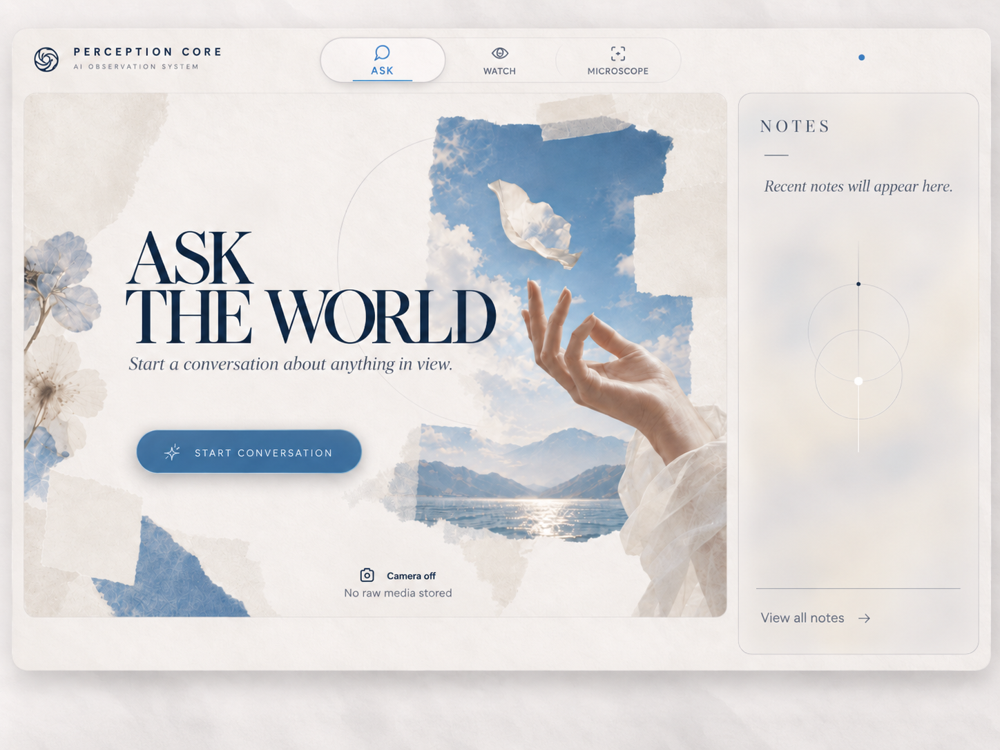
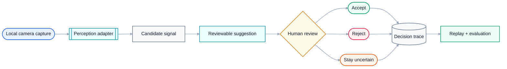
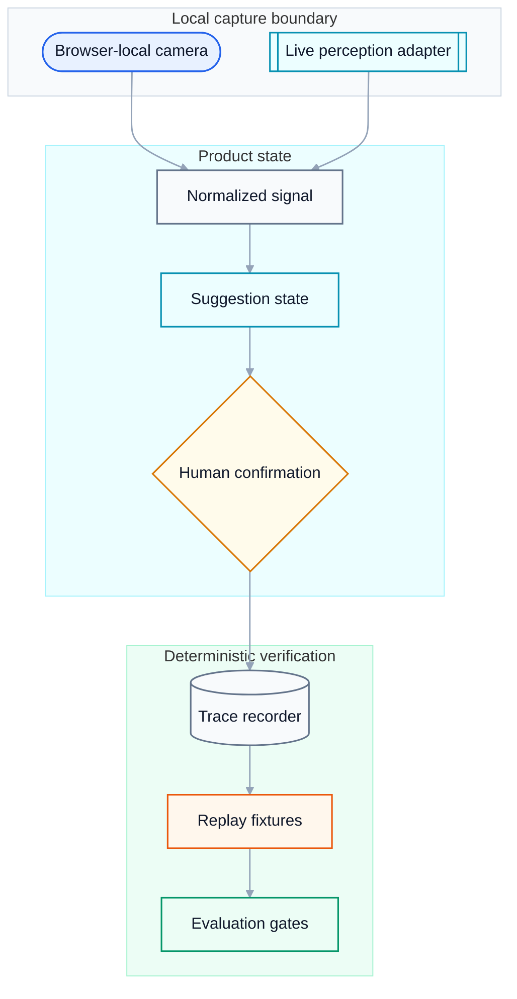

# Camera Harness

**A local-first interaction research harness for turning physical-workspace signals into reviewable suggestions, deterministic traces, and replayable evaluation.**

<p align="center">
  
</p>

<p align="center"><sub><strong>Current interface direction.</strong> Perception Core presents the camera as an ambient observation surface with explicit privacy state, conversational entry, and lightweight notes.</sub></p>

<p align="center"><sub><strong>Current design.</strong> Local camera state, operator guidance, capture progress, export and validation are composed as one restrained workspace.</sub></p>

Camera Harness explores a specific engineering problem: **how can software observe the physical world, let a person ask questions about what is in view, and still keep uncertainty, privacy, and human control explicit?**

The system separates capture, interpretation, suggestion, human confirmation, trace recording, and replay. That boundary matters: a model output can become a candidate suggestion, but it does not silently become a completed action.

## The product in 20 seconds



The interaction contract is deliberately conservative:

- **capture** records a local physical signal;
- **perception** normalizes it into a candidate;
- **suggestion** proposes a state change;
- **human review** accepts, rejects, or leaves it uncertain;
- **trace recording** preserves the decision path;
- **replay** makes the same interaction testable without repeating the physical session.

## Why I built it

Most multimodal demos collapse sensing, inference, and action into one opaque step. That is impressive on stage and difficult to debug in a real product.

Camera Harness instead treats uncertainty as part of the architecture. The interesting frontend/product problem is not only *“can a model recognize something?”* It is *“what should the interface do when recognition is incomplete, delayed, wrong, or disputed by the user?”*

## Architecture



```text
packages/
├── perception/
│   ├── browser-local-capture/      local capture prototype + tests
│   └── live-perception-adapter/    normalized live-provider boundary
├── replay/
│   └── live-trace-recorder/        trace export + validation
└── evals/
    └── bin/                         deterministic quality gates

fixtures/replay/                     replayable interaction fixtures
runs/                                evaluation outputs
```

## Engineering decisions

### Human confirmation is a first-class state

Acceptance, rejection, and uncertainty are not UI decoration. They are explicit outcomes preserved by the trace model. The deterministic suggestion fixtures include accepted, rejected, and non-progressing uncertain cases.

### Replay before spectacle

Physical interactions are expensive to reproduce manually. The harness records structured traces so regressions can be replayed repeatedly through the same gates.

### Live perception and deterministic verification stay separate

Live-provider behavior can vary. The replay/evaluation path should not. That separation lets experiments evolve without making every regression test dependent on a remote model.

### Local-first camera boundary

Camera-facing experiments are developed around a browser-local capture path. Physical context is sensitive, so the architecture keeps the privacy boundary visible rather than treating camera input as ordinary telemetry.

## Verification

```bash
npm run test:adapter
npm run test:recorder
npm run test:movement-recognition
npm run suggestions:bundle:validate
npm run typecheck
```

For the retained physical-trace path:

```bash
npm run physical:validate
npm run verify:physical
```

## Run locally

Requires a recent Node.js runtime.

```bash
git clone https://github.com/miguelalmeida0/camera-harness.git
cd camera-harness
npm install
npm run physical:capture
```

## What this project demonstrates

- local-first browser interaction;
- multimodal UI state modelling;
- human-in-the-loop product design;
- replayable test infrastructure;
- deterministic evaluation around non-deterministic inputs;
- explicit provenance and uncertainty;
- a frontend architecture that keeps rendering, perception, and state transitions separable.

## Scope

Camera Harness is an **experimental interaction and evaluation system**, not a claim of production-grade autonomous perception. Live physical-world behavior and deterministic replay evidence are intentionally described separately.

---

Built by [Miguel Almeida](https://github.com/miguelalmeida0).


[Repository guide](./docs/START_HERE.md)

<!-- repository-presentation-repair:1 -->
