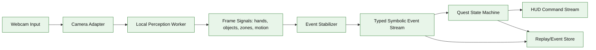
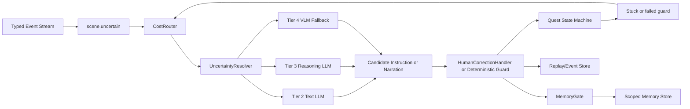
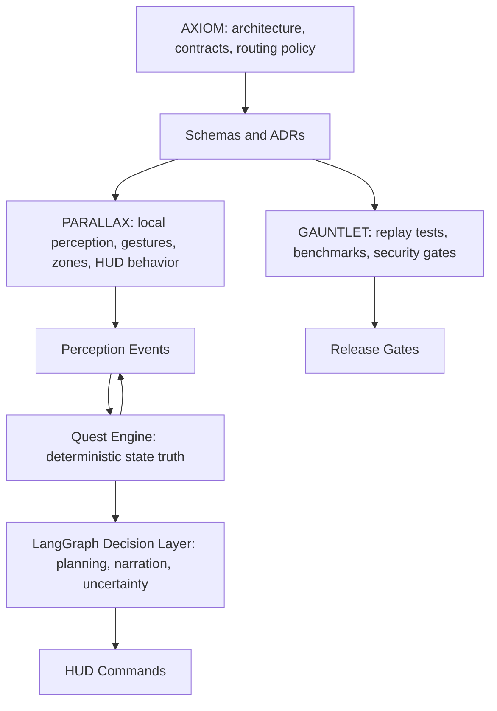
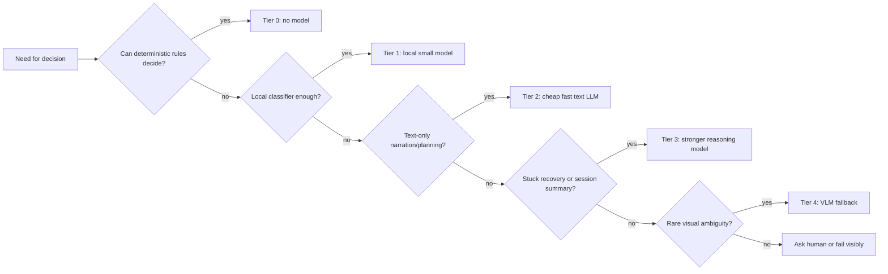
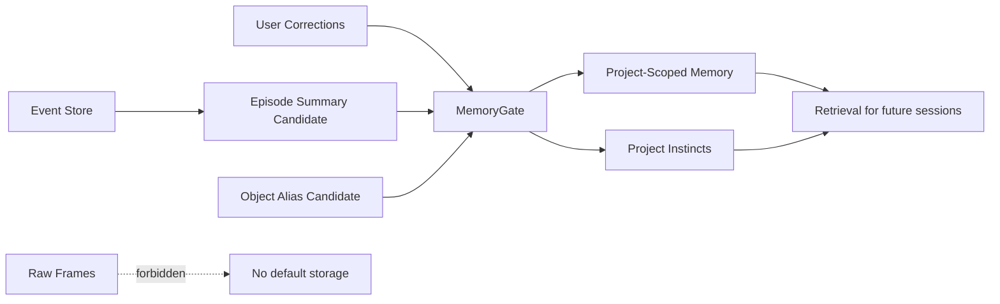
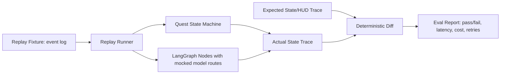
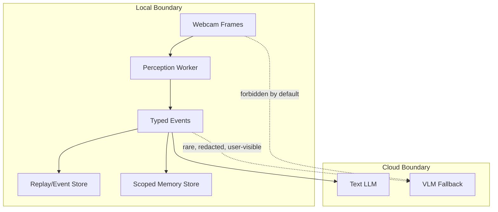

# DarkQuest Focus Ritual System Architecture

## Completion Criteria

This architecture is complete when another agent can implement the Focus Ritual without inventing new boundaries:

- Hot path and cold path are separated and diagrammed.
- Webcam frames are never sent to a cloud model by default.
- Frame-level signals are reduced to typed symbolic events before agent or LLM handling.
- Event, HUD, memory, replay, and model-routing interfaces are schema-first.
- Cost, latency, retry count, route tier, success, and failure are logged for every agent or model action.
- The normal 10-minute demo path targets less than $0.01 of LLM cost.
- Replays can reproduce quest state transitions without a camera.

## ECC Source Note

The requested ECC skill names were searched locally before this document was created:

- `agentic-engineering`
- `agent-harness-construction`
- `agent-architecture-audit`
- `cost-aware-llm-pipeline`
- `context-budget`
- `architecture-decision-records`
- `latency-critical-systems`
- `security-review`
- `continuous-learning-v2`

No matching ECC checkout or skill files were found in the available filesystem. This package therefore treats the ECC-aligned constraints in the request as binding source requirements.

## One-Page Summary

DarkQuest Focus Ritual is a local-first, replayable perception-to-quest system. The webcam is a sensor, not an LLM input stream. Local perception extracts low-level frame signals, an event stabilizer converts noisy observations into canonical events, a deterministic quest state machine owns state truth, and a LangGraph decision layer only interprets typed state when useful.

The core architecture is:

```text
webcam input
-> local perception worker
-> event stabilizer
-> typed symbolic event stream
-> quest state machine
-> LangGraph decision layer
-> HUD command stream
-> replay/event store
-> sparse LLM/VLM fallback only when needed
```

The naive architecture is explicitly rejected:

```text
webcam frames
-> cloud VLM every few seconds
-> LLM response
```

It is too expensive because video sampling creates recurring multimodal calls even when nothing meaningful changes. It is too slow because every interaction waits on network latency and model inference. It is too privacy-invasive because raw desk imagery can expose documents, devices, personal objects, and surroundings. It is too brittle because cloud image captions are not a stable state contract and cannot reliably replay exact transition logic.

State truth comes from typed events, user correction, replay fixtures, and deterministic transition rules. The LLM may narrate, plan, summarize, or help resolve uncertainty; it does not own ground truth.

## System Invariants

- Local perception owns frame interpretation on the hot path.
- The event stabilizer is the only component allowed to turn frame observations into canonical perception events.
- The quest state machine is deterministic and replayable.
- LangGraph nodes must consume and emit typed contracts.
- Tool and node responses use this envelope:

```json
{
  "status": "success",
  "summary": "Short human-readable result.",
  "next_actions": ["Optional next action id"],
  "artifacts": ["artifact://event-log/session-123"]
}
```

- Retry loops must be visible in logs and capped by policy.
- Hot path visual latency cannot depend on LLM or VLM responses.
- Raw video persistence is forbidden by default.

## Hot Path Diagram



Hot path target: perception and stabilization are local, deterministic where possible, and do not block on cloud calls.

## Cold Path Diagram



Cold path calls are sparse, async, logged, and user-visible when they involve visual ambiguity or privacy-sensitive context.

## Agent Boundary Diagram



AXIOM owns structure, not tuning. PARALLAX owns visual evidence and perception quality. GAUNTLET owns validation and release gating.

## Model-Routing Diagram



All routes log trigger, tier, input class, token estimate, latency, cost estimate, result status, and fallback result.

## Memory Diagram



Memory writes require scope, evidence event ids, confidence, TTL, and deletion eligibility.

## Replay/Eval Diagram



Replay fixtures must be sufficient to reproduce state bugs without raw video. Optional video clips may exist only in explicit test assets with consent and retention rules.

## Privacy Boundary Diagram



Cloud calls receive the narrowest possible symbolic context. Tier 4 VLM calls require a `scene.uncertain` event, a privacy scope, and a logged escalation reason.

## Required Interfaces

- `PerceptionEvent`: canonical Gate 1A state-bearing event schema in `docs/contracts/event-schema.v0.md`; `event-schema.v1.md` is reference/future runtime material until promoted by the schema-change process.
- `QuestTransition`: deterministic state transition contract in `docs/architecture/focus-ritual-state-machine.md`.
- `LangGraphNodeResponse`: response envelope with status, summary, next actions, and artifacts.
- `HUDCommand`: command emitted from deterministic state or approved LangGraph node.
- `ModelRouteDecision`: tier, trigger, forbidden checks, budget, and fallback.
- `MemoryWriteRequest`: scoped, evidence-backed memory candidate.
- `ReplayArtifact`: event log, expected trace, actual trace, and diff report.

## Operational Telemetry

Every node and tool action logs:

- `session_id`
- `run_id`
- `node_name`
- `input_event_ids`
- `state_before`
- `state_after`
- `route_tier`
- `model_name` when applicable
- `latency_ms`
- `estimated_cost_usd`
- `retry_count`
- `status`
- `failure_reason`
- `artifact_refs`

## Architecture Decision

Use a local-first symbolic-event architecture with deterministic quest state and sparse model escalation. This keeps latency predictable, protects privacy, controls cost, and makes the demo replayable.
