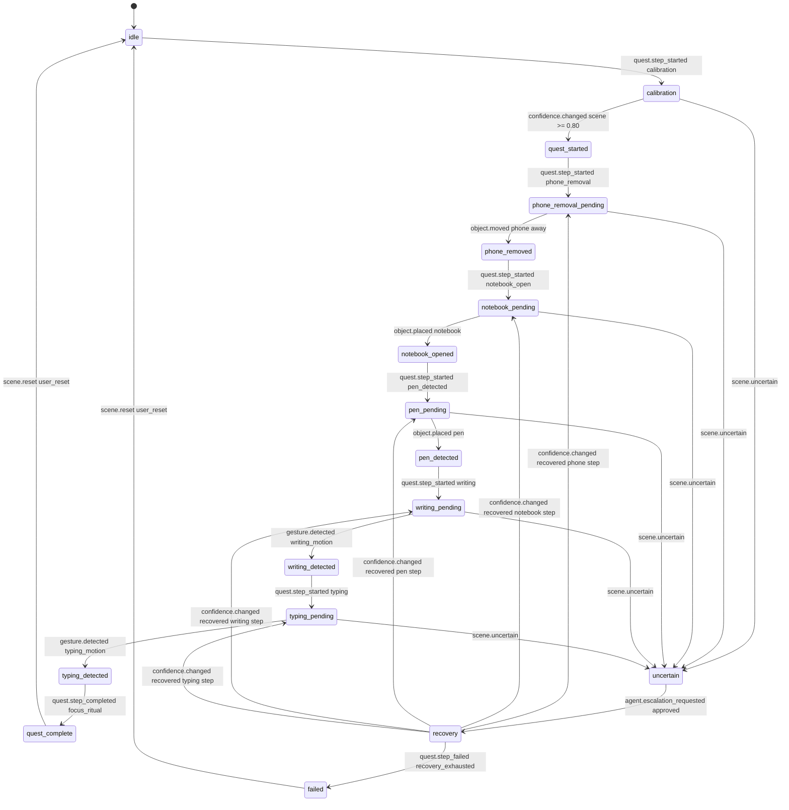

# Focus Ritual State Machine

## State Truth Rule

The Focus Ritual state machine is deterministic. The LLM must not own state truth. State truth comes from typed events, user correction, replay fixtures, and deterministic transition rules.

## Pure Reducer Contract

The quest engine must expose state transition truth as a pure reducer:

```ts
nextState = reduceQuestState(previousState, stableEvent);
```

The reducer must be referentially transparent: the same `previousState` and `stableEvent` must always produce the same `nextState`. It must not read clocks, random values, process state, files, browser storage, DOM state, camera streams, network APIs, model outputs, memory stores, or metrics. It must not mutate `previousState` or `stableEvent`.

Transition records, HUD command candidates, memory candidates, and model route requests may be derived from accepted state and event evidence, but they must be returned or emitted by explicit deterministic wrappers. They must not be hidden side effects of `reduceQuestState`.

## States

- `idle`
- `calibration`
- `quest_started`
- `phone_removal_pending`
- `phone_removed`
- `notebook_pending`
- `notebook_opened`
- `pen_pending`
- `pen_detected`
- `writing_pending`
- `writing_detected`
- `typing_pending`
- `typing_detected`
- `quest_complete`
- `uncertain`
- `recovery`
- `failed`

## Global Transition Rules

- Event store writes happen for every accepted transition.
- "Memory written" in the table means long-term memory, not event replay storage.
- Pending-step timeout default: `45000ms`.
- Local visual evidence must be stabilized before state transition.
- If a required event has confidence below threshold, transition to `uncertain` rather than guessing.
- Any automatic recovery can retry once; second failure enters `failed`.

## Mermaid Diagram



## Transition Table

| From | To | Input event | Guard condition | Confidence threshold | Stabilization window | Output HUD command | LLM called | Memory written | Failure/recovery behavior |
| --- | --- | --- | --- | --- | --- | --- | --- | --- | --- |
| `idle` | `calibration` | `quest.step_started` | `step_id == "step_calibration"` and camera permission active | `1.0` | `0ms` | `calibration_started` | No | No | If camera unavailable, emit `quest.step_failed` and remain `idle`. |
| `calibration` | `quest_started` | `confidence.changed` | `target_ref == "scene"` and `current_confidence >= 0.80` | `0.80` | `1000ms` | `quest_ready` | No | No | If scene remains unstable for `15000ms`, emit `scene.uncertain`. |
| `quest_started` | `phone_removal_pending` | `quest.step_started` | `step_id == "step_phone_removal"` | `1.0` | `0ms` | `show_phone_removal_objective` | No | No | If duplicate step start appears, ignore duplicate and log. |
| `phone_removal_pending` | `phone_removed` | `object.moved` | `object_type == "phone"` and `from_zone_id == "zone_focus"` and `to_zone_id != "zone_focus"` | `0.86` | `300ms` | `mark_phone_removed` | No | No | If object ambiguous, emit `scene.uncertain`; if timeout, emit `quest.step_failed`. |
| `phone_removed` | `notebook_pending` | `quest.step_started` | `step_id == "step_notebook_open"` | `1.0` | `0ms` | `show_notebook_objective` | No | No | If planner attempts another step, reject and log contract error. |
| `notebook_pending` | `notebook_opened` | `object.placed` | `object_type == "notebook"` and `zone_id == "zone_notebook"` and `dwell_ms >= 500` | `0.86` | `600ms` | `mark_notebook_ready` | No | No | If notebook confidence drops, emit `confidence.changed` then `scene.uncertain`. |
| `notebook_opened` | `pen_pending` | `quest.step_started` | `step_id == "step_pen_detected"` | `1.0` | `0ms` | `show_pen_objective` | No | No | If duplicate, ignore duplicate and log. |
| `pen_pending` | `pen_detected` | `object.placed` | `object_type == "pen"` and `zone_id in ["zone_notebook", "zone_focus"]` | `0.86` | `600ms` | `mark_pen_detected` | No | Optional object alias only after user correction | If ambiguous required object, `scene.uncertain` may route to Tier 4. |
| `pen_detected` | `writing_pending` | `quest.step_started` | `step_id == "step_writing_detected"` | `1.0` | `0ms` | `show_writing_objective` | No | No | If pen track is stale, return to `pen_pending`. |
| `writing_pending` | `writing_detected` | `gesture.detected` | `gesture_type == "writing_motion"` and `zone_id == "zone_notebook"` and `related_object_id == "obj_pen"` when known | `0.82` | `900ms` | `mark_writing_detected` | No | No | If motion is ambiguous, hold state and emit `scene.uncertain` after timeout. |
| `writing_detected` | `typing_pending` | `quest.step_started` | `step_id == "step_typing_detected"` | `1.0` | `0ms` | `show_typing_objective` | No | No | If planner skips typing step, reject transition. |
| `typing_pending` | `typing_detected` | `gesture.detected` | `gesture_type == "typing_motion"` and `zone_id in ["zone_keyboard", "zone_laptop"]` | `0.82` | `900ms` | `mark_typing_detected` | No | No | If keyboard zone unknown, enter `recovery` and request calibration prompt. |
| `typing_detected` | `quest_complete` | `quest.step_completed` | `quest_id == "focus_ritual"` and all required steps completed in order | `0.85` | `0ms` | `quest_complete` | Tier 2 optional narration only | Episode summary candidate | If any step missing, emit `quest.step_failed` with `failed_guard == "ordered_steps_complete"`. |
| `quest_complete` | `idle` | `scene.reset` | `reset_reason in ["user_reset", "session_end"]` | `1.0` for user reset | `0ms` | `session_reset` | No | Episode summary if approved | If reset is automatic, require audit log. |
| Any pending state | `uncertain` | `scene.uncertain` | `affected_refs` include active step, entity, or scene | `0.80` uncertainty confidence | `500ms` | `show_uncertain_state` | No direct call | No | CostRouter decides whether recovery or model escalation is allowed. |
| `uncertain` | `recovery` | `agent.escalation_requested` | route budget available and privacy scope valid | `0.85` | `0ms` | `show_recovery_state` | Yes, only approved tier | No | If budget exhausted, ask human correction. |
| `recovery` | Previous pending state | `confidence.changed` | `current_confidence >= threshold_for_blocked_guard` | step threshold | `300ms` | `resume_step` | No | User correction memory if correction supplied | Replay must record recovered guard and prior blocked event. |
| `recovery` | `failed` | `quest.step_failed` | `failure_reason == "recovery_exhausted"` or retry count exceeded | `1.0` | `0ms` | `show_failed_state` | No | Optional failure summary | User reset required to restart. |
| `failed` | `idle` | `scene.reset` | `reset_reason == "user_reset"` | `1.0` | `0ms` | `session_reset` | No | No | Keep failure replay artifact for GAUNTLET. |

## State Output Contract

Each accepted transition emits:

```json
{
  "status": "success",
  "summary": "Transition accepted: phone_removal_pending -> phone_removed.",
  "next_actions": ["emit_hud_command", "record_replay_event"],
  "artifacts": ["event_id:evt_step_completed_001"]
}
```
