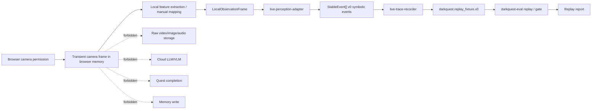

# Gate 1B Browser-Local Perception Architecture

## Purpose

Gate 1B proves that real browser-local camera observations can enter the existing symbolic replay path without creating a cloud, raw-media, or quest-state bypass.

Gate 1B does not approve cinematic HUD polish. It only approves this path:

```text
browser camera permission
-> local browser frame observation
-> local feature extraction / manual observation mapping
-> LocalObservationFrame
-> live-perception-adapter
-> StableEvent[]
-> live-trace-recorder
-> replay fixture
-> darkquest-eval harness
-> report
```

The acceptance claim is not "the camera looks good." The claim is: browser-origin symbolic traces replay deterministically with zero raw media persistence, zero model calls, honest uncertainty, and measured local latency.

## ECC Source Note

The local workspace was searched for ECC skill files before finalizing Gate 1B. No exact `agentic-engineering`, `agent-harness-construction`, `cost-aware-llm-pipeline`, `context-budget`, `architecture-decision-records`, `latency-critical-systems`, `browser-qa`, `design-system`, or `benchmark-optimization-loop` checkout was found.

Gate 1B therefore follows the ECC-aligned constraints already encoded in the project request and existing architecture docs: replay-first harnessing, typed symbolic contracts, local hot-path perception, zero-model default routing, strict memory/privacy boundaries, p50/p95 latency reporting, and disclosure instead of silent pass-through.

## System Diagram



## Browser Camera Boundary

The browser may access webcam frames only after explicit browser camera permission. Frames are sensor input, not application state. The browser capture layer may hold a frame long enough to produce local numeric/symbolic observations, then must release it.

Allowed:

- call browser camera APIs after permission;
- inspect frames in browser memory for local observation extraction;
- produce symbolic `LocalObservationFrame` objects;
- record local latency measurements;
- show transient live preview only in the active browser UI, not as persisted artifacts.

Forbidden:

- upload frames to any backend or provider;
- serialize frames into JSON;
- store frames in `localStorage`, `sessionStorage`, IndexedDB, Cache Storage, files, screenshots, or replay artifacts;
- pass frames directly to quest state, memory, HUD progress, model routing, or replay fixtures.

## Local Frame Lifetime Rules

Raw frame lifetime is bounded to the active browser processing tick. A frame may exist in camera/video/canvas memory only while local extraction runs. The durable output is symbolic:

- `LocalObservationFrame`
- `StableEvent[]`
- replay-safe evidence refs
- latency records
- privacy booleans

Detailed policy lives in `docs/architecture/browser-frame-lifetime-policy.md`.

## LocalObservationFrame Generation

Gate 1B frame extraction may begin manually and conservatively:

1. Browser capture reads current video frame in memory.
2. Manual calibration maps normalized zones.
3. Local feature extraction or manual observation mapping produces symbolic hands, objects, zones, and scene state.
4. The mapper emits `LocalObservationFrame`.
5. The adapter validates and converts observations into v0 symbolic events.

`LocalObservationFrame` is not a replay event. It is internal adapter input and must not contain raw pixels, base64 media, screenshots, OCR, notebook text, cloud evidence, or model reasoning.

## Adapter Boundary

`packages/perception/live-perception-adapter` may consume `LocalObservationFrame` and emit only valid v0 perception events:

- `scene.calibrated`
- `hand.entered_zone`
- `hand.left_zone`
- `object.moved`
- `object.placed`
- `gesture.detected`
- `zone.activated`
- `confidence.changed`
- `scene.uncertain`
- `scene.reset`

It must not emit quest, HUD, memory, or model events. It must not claim quest completion. Ambiguous browser observations hold state or emit uncertainty/reset.

## Trace Recorder Boundary

`packages/replay/live-trace-recorder` writes symbolic fixtures only. For Gate 1B browser traces it must include:

- replay fixture privacy fields;
- browser trace origin metadata from `docs/contracts/browser-trace-origin-contract.v0.md`;
- browser latency records from `docs/contracts/browser-latency-record.v0.md`;
- model call counts of zero;
- raw media persistence counts of zero.

It must reject export if raw media, base64 media, screenshots, audio, OCR, notebook text, cloud-derived local evidence, or raw media paths are detected.

## Replay Harness Boundary

The replay harness remains the release gate. It consumes exported symbolic fixtures, not browser APIs or camera frames.

Required commands before Gate 1B acceptance:

```sh
node --check packages/evals/bin/darkquest-eval.mjs
node packages/evals/bin/darkquest-eval.mjs replay --repeat 3 fixtures/replay/focus_ritual_happy_path.v0.json
node packages/evals/bin/darkquest-eval.mjs gate-0b fixtures/replay/gate_0b_manifest.json
node packages/evals/bin/darkquest-eval.mjs gate-1a fixtures/replay/gate_1a_manifest.json
```

When a Gate 1B manifest exists:

```sh
node packages/evals/bin/darkquest-eval.mjs gate-1b fixtures/replay/gate_1b_manifest.json
```

## Privacy Boundary

Gate 1B is privacy preserving by construction:

- browser frames are transient;
- replay traces are symbolic;
- memory writes are evidence-backed and never raw-media-backed;
- cloud calls are disabled;
- evidence refs must have or imply `contains_raw_media: false`;
- raw media persistence count must be `0`.

## Performance Measurement Points

Gate 1B must measure:

- browser frame capture time;
- observation extraction time;
- adapter time;
- stabilizer time;
- event emission time;
- HUD update time;
- trace recorder time;
- end-to-end local path time;
- dropped frames;
- uncertainty/reset counts.

The browser latency schema is `docs/contracts/browser-latency-record.v0.md`.

Suggested local path thresholds:

- `end_to_end_local_path_ms.p50 <= 75`
- `end_to_end_local_path_ms.p95 <= 150`
- `end_to_end_local_path_ms.max <= 300`
- `llm_calls = 0`
- `vlm_calls = 0`
- `raw_media_persistence = 0`

## Forbidden Paths

Explicitly rejected:

- browser camera -> cloud VLM;
- browser camera -> raw video storage;
- browser camera -> base64 replay fixture;
- browser camera -> direct quest completion;
- browser camera -> memory write;
- browser camera -> HUD progress without quest state;
- browser camera -> trace recorder raw media artifact;
- browser camera -> localStorage/sessionStorage/IndexedDB raw frame.

## Approval Criteria

Gate 1B can be accepted only when:

- at least one browser-generated Focus Ritual trace exports as replay-compatible symbolic fixture JSON;
- the fixture includes valid browser trace origin metadata;
- browser latency records are present and within or explicitly disclose thresholds;
- raw media persistence count is `0`;
- LLM/VLM calls are `0`;
- replay is deterministic across three runs;
- HUD honesty checks pass;
- occlusion recovery and camera bump/reset fixtures pass or are explicitly disclosed;
- TypeScript compile runs, or Gate 1B remains `PASS_WITH_DISCLOSURE` at best.
