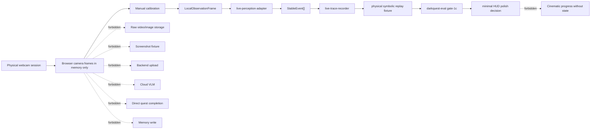

# Gate 1C Physical Webcam Architecture

## Purpose

Gate 1C proves that a real physical webcam session can produce a replay-safe symbolic fixture without raw media persistence, cloud/model calls, quest-engine impurity, or HUD state mutation.

Gate 1C does not approve cinematic HUD polish. It only decides whether a physical browser-local session is safe enough to unlock minimal state-backed HUD polish.

## ECC Source Note

The local workspace does not contain the named ECC skill checkout. Gate 1C follows the ECC-aligned constraints already established in the project docs: replay-first validation, typed symbolic events, local hot-path perception, zero-model default routing, explicit memory and privacy boundaries, latency measurement, and disclosure rather than silent pass-through.

## Architecture Diagram

## Physical Webcam Boundary

The physical browser session may request camera permission and inspect frames only inside active browser memory. Frames are sensor input, not durable app state.

Allowed:

- physical camera permission in the browser;
- transient frame reads for local observation extraction;
- manual calibration against the live preview;
- symbolic observation and latency records;
- operator confirmation that the session was physical.

Forbidden:

- raw video storage;
- screenshot fixture export;
- base64 fixture export;
- backend upload;
- cloud VLM routing;
- direct quest completion;
- memory write from frame data;
- cinematic progress without replay-backed state.

## Browser Frame Lifetime

Physical frames follow `docs/architecture/browser-frame-lifetime-policy.md`.

Frames must not be serialized, logged, screenshotted, stored in browser storage, sent to backend/cloud, sent to LLM/VLM, or included in replay fixtures. Evidence references must stay symbolic and declare or imply `contains_raw_media: false`.

## Manual Calibration Path

Manual calibration may store only:

- normalized zone geometry;
- symbolic zone IDs;
- symbolic object labels;
- calibration ID;
- calibration confidence;
- timing metadata.

Manual calibration must not store screenshots, raw frames, OCR, notebook text, or private visual content. The valid output is a normal `scene.calibrated` flow through the adapter and replay harness.

## LocalObservationFrame Generation

`LocalObservationFrame` is internal adapter input. It may contain symbolic hands, objects, zones, scene quality, and timing, but never pixels, base64, screenshots, OCR, or model reasoning.

The first physical implementation should stay conservative: local observation mapping and manual calibration are acceptable; unsupported claims must become `scene.uncertain` or `scene.reset`, not quest progress.

## Adapter Boundary

`packages/perception/live-perception-adapter` may emit only valid v0 stable-event candidates. It must not emit quest, HUD, memory, model, or unsupported state-bearing events. It must not claim completion.

## Trace Recorder Boundary

`packages/replay/live-trace-recorder` writes symbolic replay fixtures only. Physical Gate 1C fixtures must include physical trace provenance, browser latency records, privacy fields, zero model counts, and zero raw media persistence counts.

## Replay Harness Boundary

The harness is the source of truth for Gate 1C. It consumes the exported symbolic fixture, validates provenance, replays the quest, checks HUD honesty, checks privacy, checks model/cost records, checks memory policy, checks browser latency, and reports a deterministic verdict.

## Physical Trace Provenance

Physical fixtures must use `docs/contracts/physical-trace-provenance-contract.v0.md`. A browser-origin trace is not enough for Gate 1C. It must also prove `physical_capture=true` and `operator_confirmed_physical_session=true`.

## Static Validation Boundary

Runtime tests with Node type stripping are insufficient for full Gate 1C PASS. Full PASS requires package-local TypeScript validation. If TypeScript is unavailable, Gate 1C can advance only with an explicit static-validation waiver and only to `PASS_WITH_DISCLOSURE`.

## Minimal HUD Polish Boundary

Minimal HUD polish can begin only when Gate 1C is `PASS` or an explicitly accepted `PASS_WITH_DISCLOSURE`. Every visual state must be backed by quest state, HUD command, stable event, confidence value, latency/model/privacy status, or replay evidence.

## Approval Criteria

Gate 1C acceptance requires:

- physical symbolic Focus Ritual fixture exists;
- fixture replays deterministically;
- trace provenance proves physical capture and operator confirmation;
- occlusion recovery passes;
- camera bump/reset passes;
- raw media persistence count is `0`;
- LLM/VLM calls are `0`;
- HUD honesty checks pass;
- browser latency is measured;
- TypeScript validation passes or an accepted static-validation waiver exists;
- Harness, Evaluation, Memory and Safety approves minimal polish scope.

