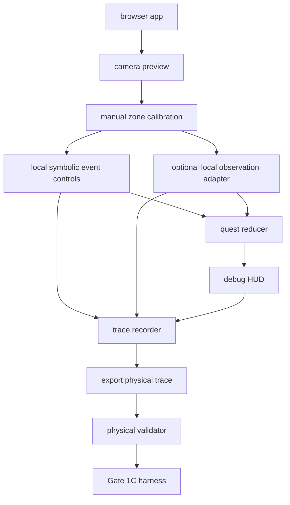

# Gate 1D Tryable Local App MVP

## Why Gate 1D Exists

Gate 1C remains the evidence gate for physical trace validation. It is still blocked by the missing physical fixture:

```text
fixtures/replay/live/live_physical_focus_ritual_001.v0.json
```

Gate 1D exists because the local app also needs to be usable before the physical trace can realistically be produced. If the user can only turn on the camera, the system has too much harness and not enough tryable local product path.

Gate 1D does not replace Gate 1C. It creates the smallest safe local loop that lets a user operate the app, emit symbolic events, export a trace, and send that trace into the existing validation path.

## Problem It Solves

Gate 1D solves local tryability:

- camera preview can start;
- required desk zones can be calibrated;
- Focus Ritual can be started;
- symbolic events can be emitted for each ritual step;
- manual local confirmation can bridge unfinished automatic perception;
- debug HUD can show quest state, event timeline, privacy, and model state;
- trace JSON can be exported;
- validation next steps are clear.

It does not solve autonomous perception quality, physical provenance proof, cinematic polish, portfolio claims, or production readiness.

## Relation To Gate 1C

Gate 1D is upstream of Gate 1C:

- Gate 1D makes the local app usable enough to generate symbolic traces.
- Gate 1C proves whether a physical trace is valid, deterministic, private, model-free, and replay-compatible.

Gate 1D may produce a candidate physical trace, but only Gate 1C can accept it.

## Allowed Functionality

- Browser-local camera preview.
- Manual zone calibration for required desk zones.
- Local symbolic event controls for the six Focus Ritual steps.
- Optional local observation adapter when available.
- Manual local confirmation when automatic detection is not ready.
- Pure quest reducer state updates.
- Debug HUD showing quest progress, event timeline, uncertainty, privacy, model, and latency state.
- Symbolic trace recorder.
- Direct export of `fixtures/replay/live/live_physical_focus_ritual_001.v0.json` as a browser download.
- Physical validation and Gate 1C rerun.

## Forbidden Functionality

- Cinematic HUD polish.
- Portfolio demo claims.
- Production-quality claims.
- Fake physical provenance.
- Claims of autonomous computer vision for manually confirmed events.
- Hidden manual confirmation.
- Raw media persistence.
- LLM/VLM calls.
- Cloud fallback in the hot path.
- Quest progress that bypasses symbolic events.
- Gate 2 approval.

## Tryable User Flow

1. Run `npm run physical:capture`.
2. Open the local app URL printed by the launcher.
3. Start camera with video only and no audio.
4. Calibrate the required desk zones.
5. Start Focus Ritual.
6. Start recording.
7. Perform each physical ritual step.
8. Use automatic local observation if available.
9. Use clearly labeled manual local confirmation if automatic observation is not ready.
10. Watch debug HUD quest state and event timeline update.
11. Stop recording.
12. Confirm physical session.
13. Export physical trace JSON.
14. Save it as `fixtures/replay/live/live_physical_focus_ritual_001.v0.json`.
15. Run `npm run physical:validate`.
16. Run `npm run gate:1c`.

## Architecture Diagram



## Acceptance Criteria

Gate 1D is accepted only when:

- `npm run physical:capture` starts a local app.
- User can turn on camera.
- User can calibrate required zones.
- User can start Focus Ritual.
- User can start recording.
- App can emit symbolic events for all six Focus Ritual steps.
- Manual local confirmation is available when automatic detection is not ready.
- Quest reducer updates debug HUD state.
- Event timeline updates.
- Privacy/model status remains visible.
- User can stop recording.
- User can export trace JSON.
- Trace can be validated or returns a clear validation error.
- No raw media is persisted.
- No model calls occur.

Gate 1D acceptance does not approve HUD polish, cinematic polish, portfolio claims, or Gate 2.
