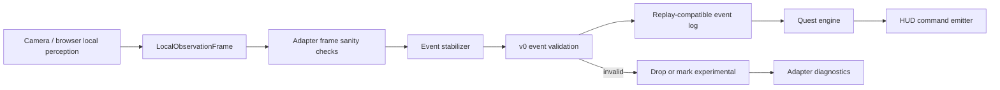

# Live Perception Adapter Boundary

## Decision

Gate 1A connects live local perception to the replay-tested system without changing state ownership. The camera and browser perception stack may produce local observations, but the quest engine sees only stable, replay-compatible v0 symbolic events.

Architecture lock: `docs/architecture/gate-1A-architecture-lock.md` is the controlling guardrail for schema drift, hidden model paths, quest reducer purity, raw-media leakage, and adapter ambiguity during Gate 1A.

Required boundary:

```text
camera/browser perception
-> local observation frame
-> stabilizer
-> stable event
-> replay-compatible event log
-> quest engine
-> HUD commands
```

No cinematic HUD polish is approved until symbolic live traces replay successfully through the Gate 0 harness.

## Boundary Responsibilities

| Layer | Owns | Emits | Must not emit |
| --- | --- | --- | --- |
| Camera/browser perception | Camera permission, local frame capture, local CV/classifier observations | `LocalObservationFrame` | Cloud model calls, quest transitions, HUD progress |
| Local observation frame | Symbolic local observations before stabilization | hands, objects, gestures, zones, scene metrics | Raw frame bytes, video paths, private document OCR |
| Stabilizer | Temporal smoothing, dwell checks, confidence gates, event IDs | v0 stable events with `producer: "event_stabilizer"` | Quest state truth, memory writes, model routes |
| Replay-compatible event log | Append-only symbolic trace | v0 events and cost/latency records | Raw video, screenshots, unstable frame signals as state |
| Quest engine | Deterministic Focus Ritual state | transition records, `quest.step_*` events | LLM/VLM-owned state |
| HUD command emitter | State-backed HUD commands | `hud.command_emitted` or report command records | Progress without evidence |

## Local Observation Frame

`LocalObservationFrame` is an internal adapter input, not a replay event. It may be richer than v0, but it must remain local and symbolic.

```json
{
  "schema": "darkquest.local_observation_frame.v0",
  "session_id": "ses_live_001",
  "timestamp_ms": 1234,
  "frame_index": 72,
  "hands": [
    {
      "hand_id": "hand_right",
      "tracking_id": "trk_hand_right_001",
      "zone_id": "zone_pen_tool",
      "confidence": 0.91,
      "gesture_hint": "reach"
    }
  ],
  "objects": [
    {
      "object_id": "obj_pen",
      "object_type": "pen",
      "zone_id": "zone_pen_tool",
      "confidence": 0.9,
      "motion_state": "moving"
    }
  ],
  "zones": [
    {
      "zone_id": "zone_notebook",
      "occupancy": "occupied",
      "confidence": 0.88
    }
  ],
  "scene": {
    "scene_confidence": 0.93,
    "lighting_quality": "ok",
    "occlusion_score": 0.12,
    "camera_bump_score": 0.01
  }
}
```

Rules:

- `timestamp_ms` is relative to session start.
- `frame_index` is allowed internally but must not be required for replay.
- Bounding boxes, landmarks, and raw frame references are not required at this boundary.
- If geometry is logged for debugging, it must be symbolic numeric metadata only, never raw media.

## Stable Event Output

The stabilizer output must be valid under `event-schema.v0.md`.

Example:

```json
{
  "id": "evt_live_phone_moved_away_001",
  "type": "object.moved",
  "timestamp_ms": 4200,
  "producer": "event_stabilizer",
  "confidence": 0.9,
  "payload": {
    "object_id": "obj_phone",
    "object_type": "phone",
    "from_zone_id": "zone_focus",
    "to_zone_id": "zone_away",
    "duration_ms": 680
  },
  "evidence": [
    {
      "kind": "metric_log",
      "ref": "trace_live_001.observation_window.4100_4780"
    }
  ]
}
```

Evidence references must point to symbolic observation windows, metrics, or prior event IDs. They must not point to raw frame images, screenshots, videos, audio, OCR, or hidden model reasoning.

## Replay-Compatible Live Trace

Live trace recording writes symbolic events only. The trace must be convertible to a replay fixture or replay input without camera access.

Minimum live trace shape:

```json
{
  "schema": "darkquest.live_symbolic_trace.v0",
  "trace_id": "trace_live_focus_001",
  "session_id": "ses_live_001",
  "started_at_ms": 0,
  "privacy": {
    "contains_raw_video": false,
    "contains_audio": false,
    "cloud_calls_expected": false
  },
  "events": [],
  "metrics": {
    "adapter_latency_records": [],
    "stabilizer_latency_records": [],
    "llm_calls": 0,
    "vlm_calls": 0,
    "estimated_cost_usd": 0
  },
  "experimental_observations": []
}
```

Rules:

- `events` must contain only v0-valid events.
- `experimental_observations` are ignored by the state machine and replay fixture conversion.
- No raw media artifacts are written by default.
- Trace conversion to `darkquest.replay_fixture.v0` must preserve event IDs, timestamps, confidence, payloads, and evidence references.

## Adapter State Machine



Invalid live observations fail closed. They can be logged as diagnostics, but they cannot be coerced into quest evidence.

## Latency and Cost Logging

Every live session must emit symbolic records sufficient for replay reports:

- camera-to-observation latency;
- observation-to-stable-event latency;
- stable-event-to-quest-transition latency;
- quest-transition-to-HUD-command latency;
- `llm_calls`;
- `vlm_calls`;
- `estimated_cost_usd`;
- raw-media persistence assertions.

Normal Gate 1A live traces should record:

```json
{
  "llm_calls": 0,
  "vlm_calls": 0,
  "estimated_cost_usd": 0,
  "raw_video_persisted": false,
  "raw_audio_persisted": false,
  "raw_frame_persisted": false
}
```

## Live Adapter Acceptance Checks

Before any live demo work:

1. Run local perception and record a symbolic live trace.
2. Validate every trace event against `event-schema.v0.md`.
3. Convert the trace into a replay fixture or replay input.
4. Run the Gate 0 harness with `--repeat 3`.
5. Confirm the result is deterministic.
6. Confirm no LLM/VLM calls occurred unless a future fixture explicitly expects them.
7. Confirm no raw media persistence occurred.
8. Confirm HUD progress commands cite quest or perception evidence.

## Failure Behavior

| Failure | Required behavior |
| --- | --- |
| Observation below threshold | Hold state; optionally emit `confidence.changed` or `scene.uncertain`. |
| Event fails v0 validation | Do not pass to quest engine; record diagnostic. |
| Experimental signal appears | Keep it off the state-bearing event stream. |
| Raw media would be persisted | Block write and fail privacy check. |
| Model route is requested | Fail unless a fixture explicitly expects it. |
| Live trace does not replay | Block cinematic demo work. |

## Handoff to PARALLAX

Implement the live adapter so its only state-bearing output is v0-valid stable events. Normalize calibration aliases into the frozen zone vocabulary before event emission. Record symbolic traces only, and keep any perception experiments outside `events`.

## Handoff to GAUNTLET

Add adversarial fixtures that prove the adapter boundary fails closed for invalid events, raw media references, unexpected model calls, missing latency/cost records, vague matchers, and experimental observations entering the state-bearing event stream.
