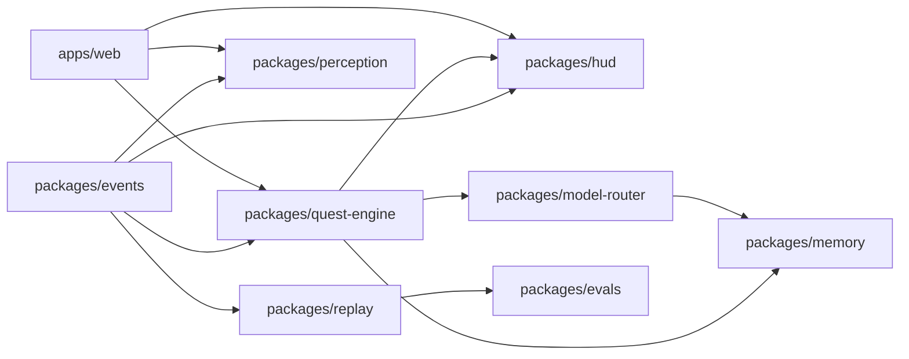

# Repo Structure Proposal

## Proposed Structure

```text
apps/
  web/
  api/
packages/
  events/
  quest-engine/
  perception/
  hud/
  memory/
  model-router/
  replay/
  evals/
docs/
  architecture/
  contracts/
  adr/
```

## Package Responsibilities

| Package | Responsibility | Public interfaces | Must not contain | Owner agent | Test strategy |
| --- | --- | --- | --- | --- | --- |
| `apps/web/` | User-facing Focus Ritual HUD and camera permission surface | HUD renderer, camera adapter, session controls | Quest state truth, model routing secrets, memory policy | PARALLAX for HUD behavior, AXIOM for boundaries | Browser QA, HUD command replay, accessibility checks |
| `apps/api/` | Optional local API for sessions, route logs, artifacts | Session API, artifact API, health checks | Raw video persistence by default, direct frame-to-cloud route | AXIOM | Contract tests, privacy boundary tests |
| `packages/events/` | Canonical event schemas and validators | `PerceptionEvent`, `HUDCommandEvent`, schema validators | UI rendering, perception tuning, model calls | AXIOM | Schema validation, fixture compatibility, version tests |
| `packages/quest-engine/` | Deterministic Focus Ritual state machine | `QuestState`, `TransitionResult`, guards | LLM prompts, camera frame processing, memory storage | AXIOM | Transition table tests, replay trace tests |
| `packages/perception/` | Local perception worker, frame signals, zone mapping | `FrameSignal`, `TrackState`, `DeskZone`, worker interface | Cloud model calls, quest narration, long-term memory | PARALLAX | Local fixture tests, latency tests, confidence calibration |
| `packages/hud/` | HUD command interpretation and visual state | `HUDCommand`, command priority rules | State truth, perception classification, model calls | PARALLAX | Command replay, screenshot QA, conflict tests |
| `packages/memory/` | Scoped local memory and MemoryGate policy | `MemoryWriteRequest`, retrieval API, deletion API | Raw frame storage by default, unscoped global memory | AXIOM | Policy rejection tests, TTL tests, replay-backed promotion tests |
| `packages/model-router/` | Tiered route decisions, cost ledger, retry policy | `ModelRouteRequest`, `ModelRouteDecision`, budget ledger | Direct UI control, state mutation, raw frame persistence | AXIOM | Budget tests, forbidden trigger tests, retry cap tests |
| `packages/replay/` | Append-only event store and deterministic replay runner | `ReplayArtifact`, `ReplayRunner`, trace diff | Perception tuning, LLM-owned state truth | GAUNTLET | Golden fixtures, checksum tests, sequence gap tests |
| `packages/evals/` | Benchmarks, failure fixtures, release gates | Eval suites, reports, thresholds | Product runtime code, hidden repair loops | GAUNTLET | CI gates, latency benchmarks, privacy/security audits |
| `docs/` | Architecture, contracts, ADRs, handoffs | Markdown docs, diagrams, schemas | Runtime source code | AXIOM | Link checks, schema examples validation |

## Dependency Direction



Rules:

- `packages/events` has no runtime dependency on app packages.
- `packages/quest-engine` depends on typed events, not camera frames.
- `packages/perception` emits events, never quest state.
- `packages/hud` consumes commands, never invents state.
- `packages/model-router` decides routes, never calls models directly without an executor boundary.
- `packages/replay` can run with models mocked or disabled.

