# Gate 0 Replay Harness

## Decision

Gate 0 is a deterministic symbolic replay gate. Live webcam, cinematic HUD work, and model-assisted recovery are blocked until a six-step Focus Ritual fixture can replay through schema validation, event stabilization/pass-through, quest state, HUD commands, memory policy, model-call checks, privacy checks, cost/latency logging, and report generation.

Gate 0 uses:

- `docs/contracts/event-schema.v0.md`
- `docs/contracts/replay-fixture-schema.v0.md`
- `docs/architecture/focus-ritual-state-machine.md`
- `docs/architecture/memory-policy.md`
- `docs/architecture/model-routing-policy.md`

## Why this is the right architecture

The replay spine makes DarkQuest falsifiable before perception tuning begins. A live camera demo can look correct while hiding missing evidence, silent model calls, raw media leakage, memory pollution, or nondeterministic state transitions. A symbolic replay fixture forces the system to prove each state change from typed events and to produce a repeatable pass/fail report.

## Required flow

```text
fixture loader
-> schema validator
-> event validator
-> event stabilizer / pass-through
-> quest state machine runner
-> HUD command checker
-> memory policy checker
-> model-call checker
-> privacy checker
-> cost/latency logger
-> report generator
```

## Harness stages

| Stage | Input | Output | Pass responsibility | Failure examples |
|---|---|---|---|---|
| Fixture loader | Fixture path | Parsed fixture object | Read JSON deterministically; reject missing file or invalid JSON. | Invalid JSON, missing fixture, unstable fixture ID. |
| Schema validator | Fixture object | Fixture validation result | Enforce `darkquest.replay_fixture.v0`, required top-level keys, privacy object, expected object, forbidden object, metrics object. | Unknown schema, raw video flag true, missing metrics. |
| Event validator | `input_events` | Valid symbolic events | Enforce `event-schema.v0` common envelope, allowed type, allowed producer, monotonic `timestamp_ms`, confidence range, typed payload fields, replay-safe evidence. | Missing `evidence`, unknown producer, non-monotonic timestamp, raw media evidence. |
| Event stabilizer / pass-through | Valid input events | Stable events | In Gate 0, local symbolic perception events may pass through as stable events after validation. Later implementations may replace this with the real stabilizer if output remains deterministic. | Expected event missing, unstable event ID changes, unexpected state-changing event. |
| Quest state machine runner | Stable events | Quest transitions and quest events | Complete Focus Ritual steps in exact order from deterministic guards. State truth must never come from LLM/VLM output. | Quest completes without phone event, writing before pen, step emitted out of order. |
| HUD command checker | Quest transitions and emitted HUD events | HUD command validation result | Ensure expected HUD commands are emitted and every progress command cites accepted evidence. HUD must show uncertainty when state is uncertain. | Success command without evidence, uncertainty hidden, missing completion command. |
| Memory policy checker | `memory.write_requested` events | Memory validation result | Enforce memory scope, evidence IDs, TTL, privacy classification, and no raw media memory. | Memory write without evidence, raw frame memory, summary facts not in evidence. |
| Model-call checker | `agent.escalation_requested` events and model logs | Model validation result | Enforce fixture permissions, route tiers, privacy scope, max call counts, and max cost. Nominal fixture allows zero LLM/VLM calls. | Unexpected Tier 4 call, full-frame VLM route, hidden repair loop. |
| Privacy checker | Fixture, events, artifacts | Privacy validation result | Assert no raw webcam/video/audio persistence in normal Gate 0 replay. | `.mp4` artifact, raw frame path, audio flag true. |
| Cost/latency logger | Stage timings and model route logs | Metrics record | Record runtime, model counts, and cost fields even when zero. | Missing runtime, missing cost record, cost over fixture limit. |
| Report generator | All stage results | `darkquest.replay_report.v0` | Produce a deterministic verdict: `FAIL`, `PASS_WITH_DISCLOSURE`, or `PASS`. | Missing section, nondeterministic observed outputs, hidden warnings. |

## Gate 0B harness self-tests

Gate 0B adversarial fixtures may use the test-only `expected.simulate` object to inject broken harness behavior, such as suppressed uncertainty HUD commands or nondeterministic stable-event ordering.

Rules:

- `expected.simulate` is allowed only for adversarial harness self-tests.
- It is not a production replay fixture feature.
- It must be registered in `fixtures/replay/gate_0b_manifest.json` with an exact expected failure-code set.
- A suite entry fails if any expected failure code is missing or any unexpected failure code appears.

## Harness state machine

```mermaid
flowchart LR
  Load["Load Fixture"] --> FixtureSchema["Validate Fixture Schema"]
  FixtureSchema --> EventSchema["Validate Event Schema"]
  EventSchema --> Stabilize["Stabilizer / Pass-Through"]
  Stabilize --> Quest["Quest State Runner"]
  Quest --> Hud["HUD Command Checker"]
  Hud --> Memory["Memory Policy Checker"]
  Memory --> Model["Model-Call Checker"]
  Model --> Privacy["Privacy Checker"]
  Privacy --> Metrics["Cost / Latency Logger"]
  Metrics --> Report["Report Generator"]
  Report --> Repeat{"Repeat requested?"}
  Repeat -- yes --> Compare["Determinism Comparator"]
  Repeat -- no --> Verdict["Final Verdict"]
  Compare --> Verdict
```



## Six-step nominal fixture

The first Gate 0 fixture must prove this ordered path:

| Order | Required step | Completing evidence | Expected HUD command |
|---:|---|---|---|
| 1 | `step_phone_away` | `object.moved` phone from `zone_focus` to a non-focus zone. | `hud_mark_phone_away` |
| 2 | `step_notebook_open` | `object.placed` notebook in `zone_notebook` with `dwell_ms >= 500`. | `hud_mark_notebook_open` |
| 3 | `step_pen_pickup` | `object.moved` or `object.placed` pen in `zone_notebook` or `zone_focus`. | `hud_mark_pen_pickup` |
| 4 | `step_write_three_bullets` | `gesture.detected` writing motion in `zone_notebook` with enough repetitions/window. | `hud_mark_write_three_bullets` |
| 5 | `step_start_typing` | `gesture.detected` typing motion in `zone_keyboard` or `zone_laptop`. | `hud_mark_start_typing` |
| 6 | `step_quest_complete` | Deterministic completion after prior five accepted steps. | `hud_quest_complete` |

## Event stabilizer / pass-through contract

Gate 0 does not require live frame stabilization. It requires deterministic stable event handling.

Pass-through rules:

- Input events from `perception.local` and `event_stabilizer` can become stable events only after schema validation.
- Stable event IDs must remain deterministic.
- Expected stable events are matched by exact `event_id`, type, producer, confidence floor, payload constraints, and evidence references.
- Event-family assertions are forbidden. A matcher with only broad fields such as type and confidence can pass the wrong event and must fail with `stable_event_assertion_too_broad`.
- Extra state-changing stable events fail unless the fixture explicitly allows them.

Future replacement rule:

- The real `EventStabilizer` may replace pass-through only when it produces identical expected stable events for the nominal fixture and deterministic reports across three repeated runs.

## Quest runner contract

The quest runner accepts only stable symbolic events and emits ordered transition records.

Transition record shape:

```json
{
  "from_state": "phone_removal_pending",
  "to_state": "phone_removed",
  "trigger_event_id": "evt_phone_moved_stable",
  "emitted_event_id": "evt_step_phone_away_completed",
  "emitted_event_type": "quest.step_completed",
  "step_id": "step_phone_away"
}
```

Rules:

- Transitions must occur in expected order.
- Each transition must cite the accepted trigger event.
- Expected transition matchers must include `from_state`, `to_state`, `trigger_event_id`, `emitted_event_type`, and `step_id`.
- `step_quest_complete` can only occur after all prior required steps.
- LLM/VLM output is never accepted as transition evidence.
- Low-confidence or out-of-order evidence must hold state or emit uncertainty, not complete the quest.

## HUD checker contract

HUD command record shape:

```json
{
  "command_id": "hud_mark_phone_away",
  "command_type": "mark_step_complete",
  "target_surface": "quest_panel",
  "related_step_id": "step_phone_away",
  "evidence_event_ids": ["evt_step_phone_away_completed"],
  "visual_state": "complete"
}
```

Rules:

- Progress commands must include evidence event IDs.
- Expected HUD matchers must include `command_id`, `command_type`, `target_surface`, `related_step_id`, and `evidence_includes`.
- `show_uncertain_state` must appear when accepted `scene.uncertain` affects the active step.
- `quest_complete` must cite completion evidence.
- HUD commands cannot invent state.

## Memory checker contract

Nominal Gate 0 expects no memory writes.

If a fixture expects a memory write, the write must include:

- `memory_scope`
- `memory_subject`
- `memory_value`
- `evidence_event_ids`
- `ttl_days`
- `privacy_classification`

Forbidden:

- raw frame memory
- raw video memory
- raw audio memory
- memory without evidence
- LLM narration stored as fact
- private desk details unrelated to the quest

## Model-call checker contract

Nominal Gate 0 allows:

```json
{
  "max_llm_calls": 0,
  "max_vlm_calls": 0,
  "max_cost_usd": 0
}
```

Rules:

- Any `agent.escalation_requested` event is treated as a model route request.
- A fixture with `privacy.cloud_calls_expected: false` fails on any model route request.
- Tier 4 routes must never use `privacy_scope: "full_frame"`.
- Hidden repair loops are failures.

## Cost/latency logger

Every report must include:

```json
{
  "latency_cost": {
    "replay_runtime_ms": 0,
    "llm_calls": 0,
    "vlm_calls": 0,
    "estimated_cost_usd": 0,
    "records_present": true
  }
}
```

Runtime may vary across repeated runs, but it must be recorded and stay under the fixture limit. Model counts, costs, state transitions, HUD commands, memory writes, and verdict must be deterministic.

## Determinism comparator

Run the same fixture three times. Normalize volatile fields:

- `run_id`
- `replay_runtime_ms`
- report write path

Compare:

- final verdict
- validation booleans
- stable event IDs/types
- quest transition sequence
- HUD command sequence
- memory write IDs/scopes
- model call IDs/tiers
- privacy result
- failure codes

Any difference fails Gate 0.

## Alternatives rejected

| Alternative | Why rejected |
|---|---|
| Start with live webcam | Too many variables; cannot prove state, privacy, or determinism. |
| Screenshot-only QA | Visual output can hide missing evidence and unexpected model calls. |
| LLM-based fixture judging | Reintroduces nondeterminism into the gate. |
| Raw video replay first | Violates privacy posture and blocks symbolic state validation. |

## Failure modes

| Failure mode | Gate 0 detection |
|---|---|
| Quest completes without supporting events | Quest transition checker rejects completion evidence. |
| Model call occurs without permission | Model-call checker fails on unexpected route. |
| Memory write lacks evidence | Memory policy checker fails. |
| HUD hides uncertainty | HUD checker requires `show_uncertain_state`. |
| Raw media persisted | Privacy checker fails on flags, evidence refs, or artifact names. |
| Replay output changes | Determinism comparator fails after three runs. |

## Cost/latency impact

Gate 0 has zero model cost. Runtime target for the nominal fixture is `<= 1000ms` locally. The replay harness should stay dependency-light and fast enough to run before every demo build.

## Handoff to next agent

Implement the runner behind:

```bash
darkquest-eval replay fixtures/replay/focus_ritual_happy_path.v0.json
darkquest-eval replay --repeat 3 fixtures/replay/focus_ritual_happy_path.v0.json
darkquest-eval report runs/latest.json
```

GAUNTLET owns the pass/fail gate. PARALLAX and AXIOM must not continue demo feature work until this gate passes.
