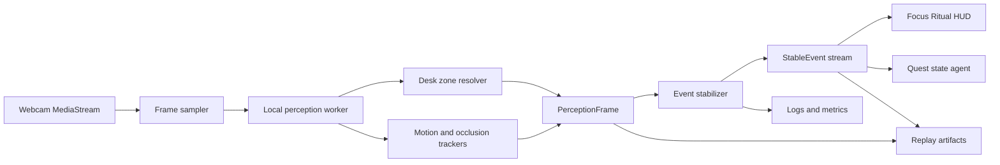

# DarkQuest Focus Ritual Perception Implementation Plan

## Decision

Build the Focus Ritual perception loop as a local-first browser pipeline. The hot path must convert webcam frames into typed symbolic state and stable events without cloud calls. Cloud inference is allowed only on the cold path for optional offline review, fixture labeling, or benchmark analysis.

ECC inspection note: the accessible local workspace did not contain exact `latency-critical-systems`, `browser-qa`, `dashboard-builder`, `agent-harness-construction`, `agentic-engineering`, `cost-aware-llm-pipeline`, `design-system`, or `benchmark-optimization-loop` skill files. I inspected the adjacent harness checkout and used its evidence-first, eval-first, observable pipeline rules as the working ECC constraint set.

## Why this is the right architecture

The live desk quest surface needs low-latency visual state, not a chatbot. The browser should capture frames, run deterministic and local ML/perception workers, stabilize noisy signals, then emit a small event stream for the HUD and agent harness. This keeps privacy strong, avoids per-frame model cost, enables replayable visual proof, and makes failures debuggable from fixtures.

The pipeline:



## Required ECC skills

Use these ECC skill intents as implementation constraints:

| ECC skill | Constraint applied |
|---|---|
| `latency-critical-systems` | Keep the hot path local, bounded, sampled, and measurable with p50/p95 frame and event latency. |
| `browser-qa` | Verify camera permission states, synthetic MediaStream fixtures, viewport HUD behavior, and replay screenshots. |
| `dashboard-builder` | Expose live diagnostics for frame rate, detection confidence, event latency, dropped frames, and uncertainty. |
| `agent-harness-construction` | Emit typed events only; agents consume symbolic state, not raw frames. |
| `agentic-engineering` | Separate perception, stabilization, memory, agent routing, and HUD responsibilities. |
| `cost-aware-llm-pipeline` | Zero cloud calls on the hot path; optional cloud calls are batch/cold-path only and cost-tagged. |
| `design-system` | HUD overlays use calibrated zones and clear confidence states without turning into a generic chat UI. |
| `benchmark-optimization-loop` | Add fixtures for every signal and report precision, latency, false positives, and false negatives. |

## System invariants

- The local hot path produces useful state when offline.
- Raw camera frames stay in-browser unless the user explicitly exports a replay artifact.
- Every stable event has confidence, uncertainty inputs, and evidence references.
- Agents never inspect raw video directly; they receive typed `StableEvent` and periodic state summaries.
- The HUD can always explain whether a state is stable, uncertain, occluded, or stale.
- Perception workers can be replayed from recorded frame fixtures.
- Camera permission denied is a valid mode with manual ritual controls, not a fatal app state.

## Interfaces and schemas

Core frame schema:

```ts
type PerceptionFrame = {
  timestampMs: number;
  hands: HandObservation[];
  objects: ObjectObservation[];
  zones: ZoneObservation[];
  scene: SceneObservation;
};

type StableEvent = {
  type: string;
  id: string;
  timestampMs: number;
  confidence: number;
  evidence: EvidenceRef[];
  payload: Record<string, unknown>;
};
```

Event namespace:

| Event type | Meaning | Primary consumer |
|---|---|---|
| `gesture.detected` | Debounced hand gesture or activity primitive detected. | HUD and ritual controls. |
| `hand.entered_zone` | Tracked hand entered a calibrated desk zone after stabilization. | HUD and attention model. |
| `hand.left_zone` | Tracked hand left a calibrated desk zone after stabilization. | HUD and attention model. |
| `object.placed` | Object rested in a zone beyond the required dwell threshold. | Quest state and replay. |
| `object.moved` | Object changed position or zone beyond movement threshold. | Quest state and HUD. |
| `zone.activated` | A zone became active after stabilized occupancy or dwell. | HUD overlay. |
| `scene.uncertain` | Occlusion, camera bump, drift, or reset suspicion blocks confident state. | HUD, diagnostics, and cost router. |
| `confidence.changed` | Confidence degraded or recovered across a policy threshold. | Diagnostics and fallback routing. |
| `scene.reset` | Explicit reset clears stabilizer or calibration state. | Perception loop and HUD. |

Evidence schema:

```ts
type EvidenceRef = {
  kind: "frame" | "observation" | "zone" | "metric" | "replay";
  id: string;
  timestampMs: number;
  rect?: Rect;
  score?: number;
  note?: string;
};
```

## Hot path implementation

1. Capture webcam with `navigator.mediaDevices.getUserMedia({ video })`.
2. Render only to an internal `<video>` and draw sampled frames to an `OffscreenCanvas` where supported.
3. Run local workers:
   - hand landmarks with MediaPipe Tasks Vision or equivalent WebAssembly backend;
   - lightweight object proposals from local color/edge/background differencing for v1;
   - zone resolution by polygon hit-testing;
   - scene similarity from grayscale thumbnails and corner/edge features.
4. Build `PerceptionFrame`.
5. Feed `PerceptionFrame` into `packages/perception/event-stabilizer`.
6. Emit `StableEvent[]` to the HUD, ritual state machine, logs, and replay recorder.

Cloud calls are excluded from steps 1-6.

## Signal plan

| Signal | Local method | Expected latency | Confidence metric | Failure mode | Fallback | Emitted event type | Test fixture needed |
|---|---|---:|---|---|---|---|---|
| Webcam capture | `getUserMedia`, video track constraints, hidden video element, `requestVideoFrameCallback` when available. | 5-20 ms capture overhead after permission. | Track ready state, frame age, resolution match, dropped-frame ratio. | Permission denied, inactive device, low light, background throttling. | Manual ritual mode, lower resolution, prompt to reconnect camera. | `camera.ready`, `camera.unavailable`, `frame.sampled`. | Browser permission matrix plus fake MediaStream fixture. |
| Frame sampling | Adaptive sampler targets 12 fps perception, 30 fps HUD; drops frames if worker p95 exceeds budget. | 1-4 ms scheduling. | Sample interval error, worker queue depth, dropped-frame rate. | Worker backlog causes stale observations. | Reduce to 8 fps, skip object pass before hand pass, emit stale state. | `perception.backpressure`, `frame.sampled`. | Synthetic timer fixture with slow worker injection. |
| Local hand detection | MediaPipe hand landmarker in Web Worker/WASM, `numHands: 2`, landmarks normalized to frame coords. | 12-35 ms at 640x360 on modern laptop. | Detector score, landmark presence, temporal landmark stability. | Hands under desk, motion blur, low light, self-occlusion. | Continue last-known smoothed hand for <=300 ms, then mark absent/uncertain. | `hand.entered_zone`, `hand.left_zone`, `gesture.detected`. | Recorded hand enter/exit, open palm, pinch, point, blurred motion clips. |
| Gesture detection | Landmark geometry rules: pinch distance, palm openness, index pointing vector, wrist velocity. Debounced by stabilizer. | 1-3 ms after landmarks. | Rule margin from threshold, hand detector score, consistency across frames. | Similar poses trigger wrong gesture, one-frame false positives. | Require longer streak, lower gesture to uncertain HUD hint. | `gesture.detected`. | Landmark JSON sequences for pinch/open/point/no-gesture. |
| Desk-zone calibration | User draws polygons on camera still; store normalized points and calibration fingerprint. | 0 ms per frame for stored geometry; 1-2 ms hit-test. | Polygon area sanity, overlap score, calibration age, scene fingerprint match. | Bad manual polygon, zones overlap, camera moves. | Neutral/uncertain zone assignment; ask for recalibration. | `zone.activated`, `confidence.changed`, `scene.uncertain`. | Calibration JSON plus frame-size resize fixtures. |
| Object dwell detection | Track object centroid in zone; dwell when stationary and same zone for threshold. | 1-2 ms per tracked object. | Zone confidence * object confidence * stationary score * duration ratio. | Slow moving object counted as dwell. | Increase stationary threshold or require hand absence before dwell. | `object.placed`. | Object stationary in phone/notebook zone for 1-10 seconds. |
| Object motion detection | Background differencing, optical-flow-like centroid delta, track displacement and velocity. | 2-8 ms at sampled resolution. | Motion energy, centroid consistency, track age, zone transition confidence. | Lighting flicker looks like motion, hand movement merges with object. | Suppress object motion while hand overlaps object bbox; require persistence. | `object.moved`, `object.placed`. | Object picked up, nudged, placed; lighting flicker negative fixture. |
| Occlusion detection | Compare visible desk mask area, hand/object oversized bboxes, edge density loss, scene brightness shift. | 1-4 ms. | Occluded desk area ratio, baseline similarity drop, detector missingness. | Dark clothing or shadow counted as occlusion. | Mark uncertainty spike; avoid semantic object events until stable. | `scene.uncertain`, `confidence.changed`. | Full hand over lens, partial arm block, shadow-only fixture. |
| Confidence scoring | Weighted per-observation score from detector confidence, geometry sanity, temporal stability, zone certainty. | <1 ms. | `0..1` score with components logged. | Overconfident local detector in novel lighting. | Cap confidence when scene uncertainty is high or calibration drift is active. | Included on all events. | Unit vectors of component combinations and expected caps. |
| Uncertainty scoring | Inverse confidence plus disagreement: missing frames, detection churn, high velocity, zone ambiguity, scene drift. | <1 ms. | `0..1` uncertainty and delta from rolling baseline. | Quiet failure if all detectors confidently wrong. | Periodic visual proof frame, human-visible HUD state, benchmark review. | `confidence.changed`, `scene.uncertain`. | Confidence collapse, camera bump, occlusion, ambiguous zone overlap fixtures. |
| Event stabilization | EMA smoothing, min-frame streaks, dwell timers, cooldowns, hysteresis, reset gates. | <1 ms for typical frame. | Event confidence from smoothed observations and stability duration. | Real quick gesture suppressed by debounce. | Tunable thresholds; expose debug timeline and raw candidate events in replay. | All stable event types. | One-frame false positive, noisy landmark, repeated gesture, dwell crossing fixtures. |
| Scene reset detection | Scene fingerprint: downscaled luma histogram, edge map, zone anchor drift, camera bump score. | 2-6 ms. | Fingerprint distance, corner/edge displacement, calibration mismatch. | Large intentional desk change interpreted as camera move. | Enter "review reset" HUD state; preserve old zones until user confirms. | `scene.uncertain`, confirmed `scene.reset`. | Camera nudge, full desk clear, lighting change, laptop moved fixtures. |

## Frame sampling strategy

Default targets:

| Condition | Capture | Perception | HUD |
|---|---:|---:|---:|
| Normal laptop | 640x360 | 12 fps | 30 fps overlay |
| High load | 480x270 | 8 fps | 30 fps overlay |
| Calibration | Current camera resolution still | On demand | 30 fps overlay |
| Replay validation | Fixture native resolution | Deterministic fixture timestamps | Rendered snapshots |

Sampling rules:

- Use `requestVideoFrameCallback` for real frame timestamps; fall back to `requestAnimationFrame`.
- Maintain a worker queue of max 1 pending frame. Drop newest or oldest based on timestamp age; never process a stale backlog.
- Always prioritize hand/scene health over object detail.
- Emit `perception.backpressure` if p95 worker time exceeds the target interval for 10 seconds.
- Persist frame hashes, not full frames, during normal use; full replay frames require explicit debug/export mode.

## HUD behavior

- The main screen is the live desk quest surface: camera image, calibrated zones, object/hand overlays, and ritual state.
- Stable zones render as thin overlays; uncertain zones pulse or desaturate.
- The HUD does not show a chat input by default.
- Event toasts must include a confidence state and disappear quickly.
- When uncertainty is high, the HUD should reduce claims, show "uncertain", and keep controls manual.
- Camera bump or scene reset pauses zone-specific quest updates until confirmed or recalibrated.

## Replayable visual proof

Each debug replay bundle should contain:

- `frames/` sampled stills or hashed references, depending on privacy mode;
- `frames.jsonl` with `PerceptionFrame` records;
- `events.jsonl` with `StableEvent` records;
- `metrics.jsonl` with latency and uncertainty;
- `zones.json` with calibration state;
- `manifest.json` with browser, model, detector version, thresholds, and privacy mode.

Minimum replay checks:

- Render HUD overlay for selected timestamps.
- Re-run the stabilizer and compare event IDs/types.
- Compute per-signal false positives and false negatives against labels.
- Export before/after screenshots for browser QA.

## Alternatives rejected

| Alternative | Why rejected |
|---|---|
| Cloud vision every frame | Too expensive, high latency, privacy-hostile, and hard to replay deterministically. |
| Agent reads raw video | Blurs perception and reasoning boundaries; creates untyped, untestable behavior. |
| Single-frame event triggers | Causes false positives from blur, lighting, and transient hand poses. |
| Generic chatbot shell | Violates the product premise; the focus ritual surface is the camera desk, not chat. |
| Full object detector as v1 dependency | Object taxonomy tuning is not owned here; v1 can infer useful dwell/motion state locally with zones and motion. |

## Failure modes

| Failure mode | Detection | Response |
|---|---|---|
| Camera permission denied | `getUserMedia` error. | Manual ritual mode, visible setup state, no fake live data. |
| Low light | Brightness and detector confidence collapse. | Lower confidence, ask for lighting change, keep manual controls. |
| Camera bump | Scene fingerprint drift and edge displacement. | Emit `scene.uncertain` with `uncertainty_kind: "camera_bump"`, pause zone claims, request reset. |
| Zone drift | Occupancy contradicts baseline or zones no longer align to anchors. | Mark zones uncertain; preserve old calibration until user acts. |
| Hand/object merge | Hand bbox overlaps object bbox during motion. | Suppress object moved/placed events until hand clears. |
| Rapid intentional gesture | Debounce may suppress short events. | Tune gesture thresholds with fixture suite; expose raw candidates in debug. |
| Background browser throttling | Frame age and sampling interval spike. | Emit stale state and stop emitting new semantic events. |
| Detector version drift | Replay diff changes event output. | Pin detector version in manifest; run benchmark loop before upgrade. |

## Cost/latency impact

Hot path cost is local CPU/GPU only. Expected p95 on a modern laptop:

| Stage | p95 target |
|---|---:|
| Frame sampling and canvas copy | 6 ms |
| Hand landmarks | 35 ms |
| Motion/object pass | 10 ms |
| Zone resolution | 2 ms |
| Stabilizer | 1 ms |
| Event publish and HUD update | 4 ms |

At 12 fps perception, the system should keep event latency under 150 ms p95 for gesture and occupancy changes, while dwell events intentionally wait for configured thresholds. Cloud cost is $0 on the live loop.

## Handoff to next agent

Next agent should implement the camera worker and HUD integration against `packages/perception/event-stabilizer`. They should add browser QA fixtures for fake MediaStream, camera permission failure, calibration overlay rendering, and replay bundle rendering before tuning object detection.
